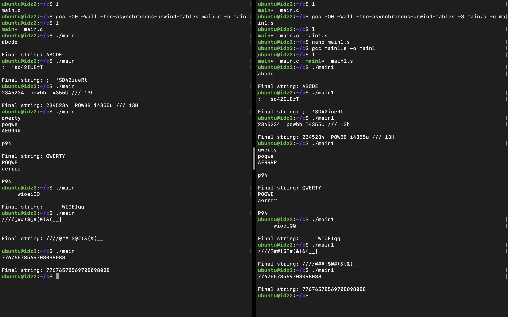
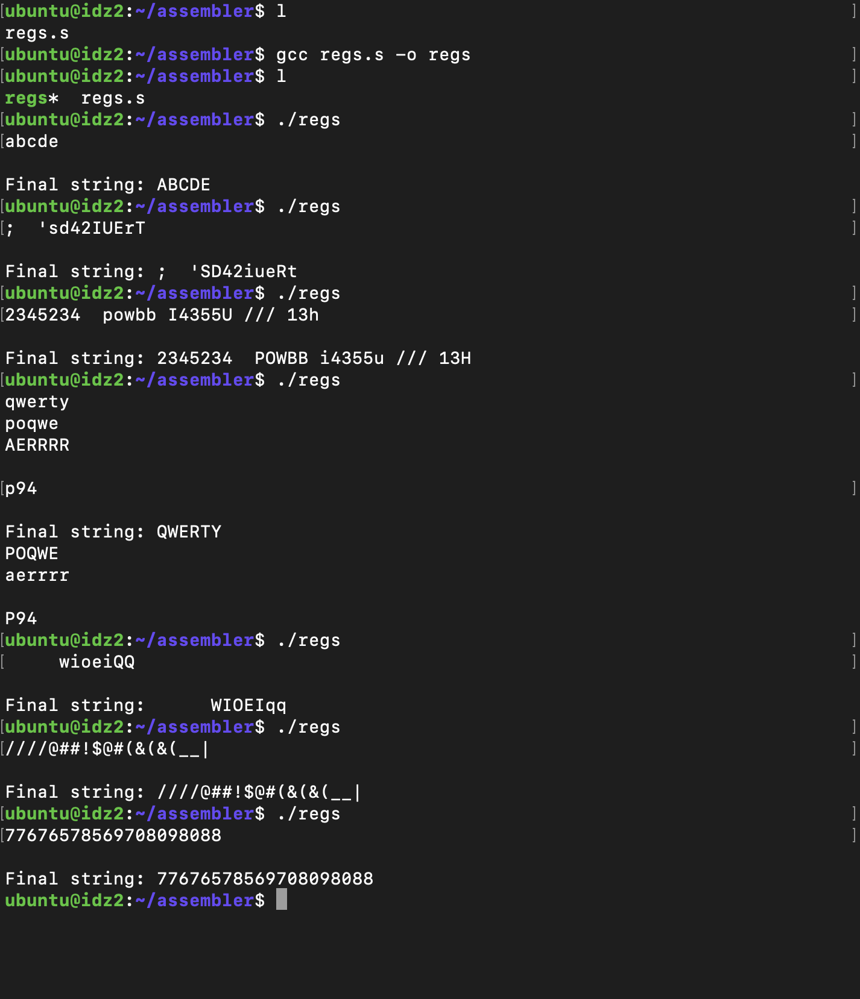

# Архитектура вычислительных систем

## Индивидуальное домашнее задание №2

### Швецов Данил Игоревич, БПИ219

#### Вариант 13
Задание: Разработать программу, заменяющую все строчные буквы в заданной ASCII-строке прописными, а прописные буквы — строчными.

## Отчет

### Данное индивидуальное домашнее задание выполнено на оценку 6. 

* Написанное решение программы на C:
>

* Программа откомпилирована без оптимизирующих и отладочных опций, убраны 
лишние макросы за счет использования соответствующих аргументов командной 
строки с помощью следующих инструкций интерпретатора и ручного модифицирования:
    * $ gcc -O0 -Wall -fno-asynchronous-unwind-tables main.c -o main
    * $ gcc -O0 -Wall -fno-asynchronous-unwind-tables -S main.c -o main1.s
    * $ gcc main1.s -o main1

  В результате получены 2 исполняемые программы "main" и "main1", которые можно 
запустить из той же директории с помощью команд:
  * ./main
  * ./main1

  Приведем примеры тестовых покрытий для обеих программ:
  >
  
    Затем представлено полное тестовое покрытие, дающее одинаковый результат 
на обеих программах. Проанализировав полученные результаты, можно сделать 
вывод, что выполняется условие эквивалентности функционирования двух 
программ, и все работает корректно.

* Также мной был произведен рефакторинг программы на ассемблере за счет максимального использования регистров процессора, было произведено добавление данной программы к уже представленным, а также были добавлены комментарии в разработанную программу, поясняющие эквивалентное использование регистров вместо переменных исходной программы на C. С результатами выполненной работы можно ознакомиться в файле "regs.s".
Скомпилировать данную программу можно с помощью следующей инструкции интерпретатора:
    * $ gcc regs.s -o regs
  
    Ниже представлено полное тестовое покрытие данной программы. Проанализировав полученные результаты, можно сделать 
вывод, что выполняется все работает корректно.
>

  Если сопоставить размеры программы на ассемблере, полученной после компиляции с языка C, с модифицированной программой, использующей регистры, то стоит отметить, что число строк без использования регистров: 159, а с использованием регистров: 131, что говорит о том, что код получился менее объемным во втором случае.
